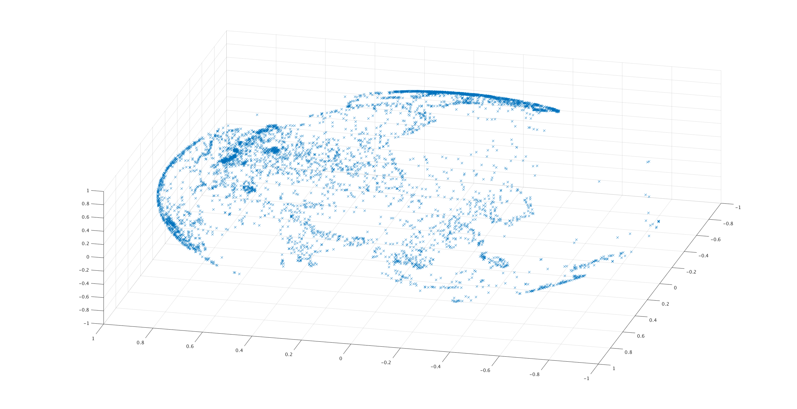
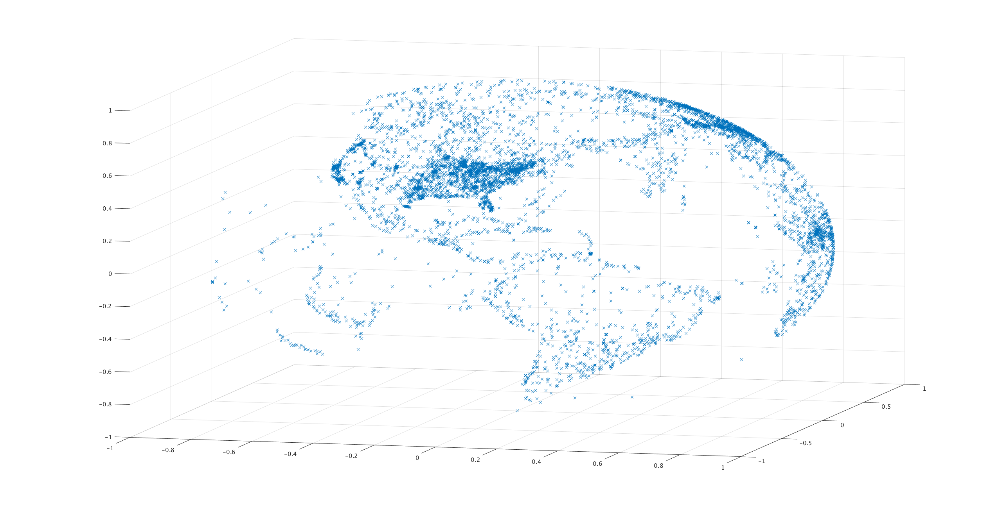

# Ho ho ho!

##### My entry into Reaktor's 2018 ["Traveling Santa"](https://traveling-santa.reaktor.com/) competition

The goal is to minimize distance for visiting all nodes, but it differs from classic Traveling Salesman problem in that there are weight constraints which force us to do several trips (like a Knapsack problem).

My solution is a mix of heuristics (creating a "smart" route from scratch) and optimization (modifying an existing route).

Visualization credit to kllp.